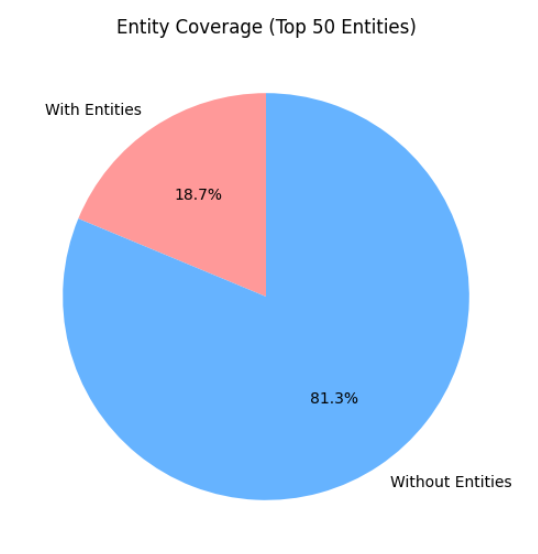
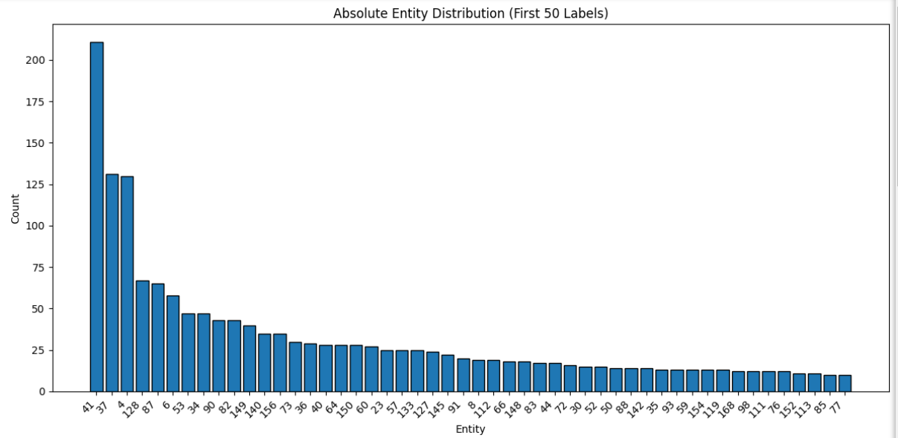
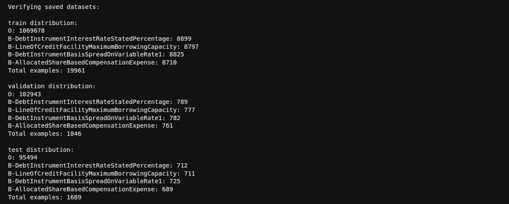
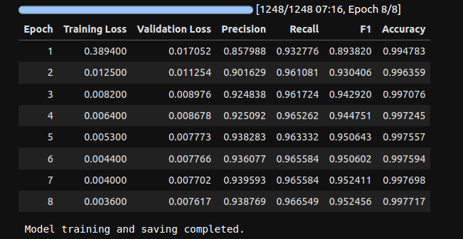
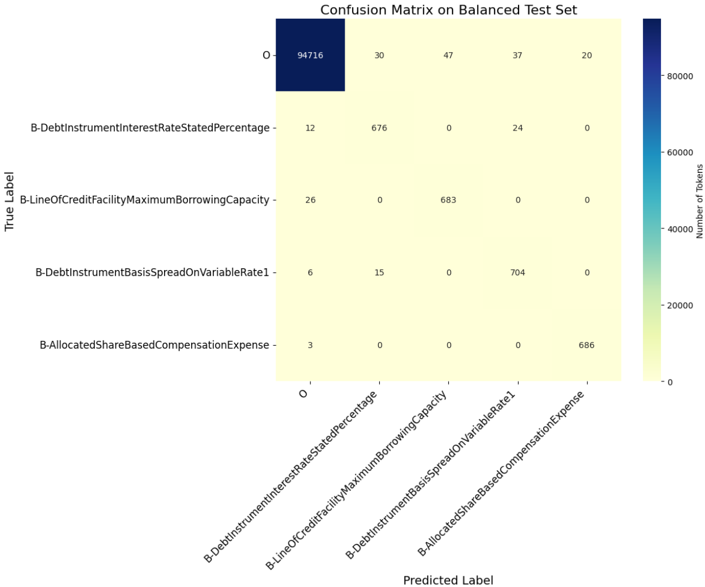
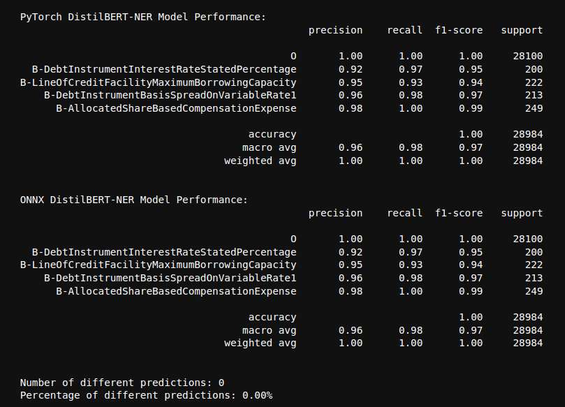
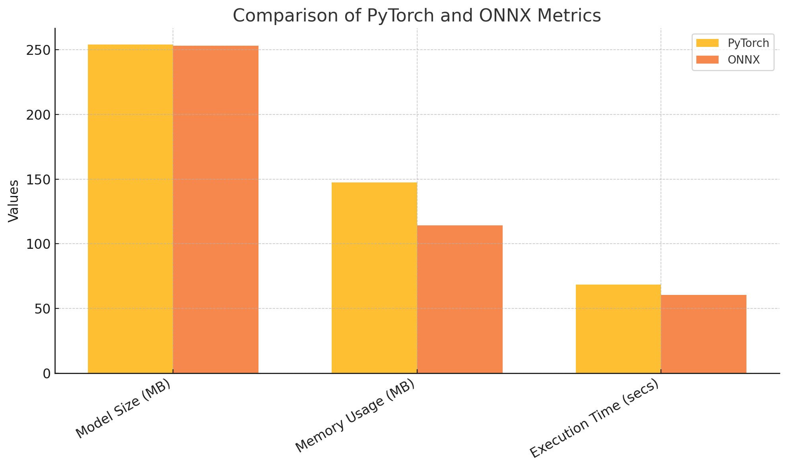

# Fine-Tuning Report: DistilBERT for Named Entity Recognition (NER) with Finer Dataset

## Dataset, Training, and ONNX Conversion Results

---

## **1. Original Dataset Overview**

### **1.1 Dataset Statistics**
1. **Number of Samples**:
    - **Train**: 900,384
    - **Validation**: 112,494
    - **Test**: 108,378

2. **Entity Coverage**:
   - Only **18.7%** of the dataset includes labeled entities, with **81.3%** being non-entity tokens.
   - **Implication**: This imbalance requires careful handling to prevent bias toward non-entity tokens.

   

3. **Entity Distribution**:
   - Entity types are unevenly distributed.
   - Less frequent entities may require oversampling or augmentation to improve recognition.

   

---

## **2. New Dataset Creation and Split**

### **2.1 Label Selection**
- Selected 4 labels based on analysis of tag frequencies, ensuring balanced representation.
- Remapped tags to create a new, smaller, and more balanced subset of the original dataset.
- For the simplicity of the training, we opted out the non-entity containing examples.

### **2.2 Data Split**
- An **80/10/10** split ensures consistent representation of entity types across splits:
  - **Training Set**: ~20,000 examples
  - **Validation Set**: ~1,800 examples
  - **Test Set**: ~1,600 examples

   

---
- **Dataset**: https://huggingface.co/datasets/sojimanatsu/finer-selected-4-labels

## **3. Training**

### **3.1 Training Overview**
- **Base Model**: DistilBERT (pretrained) - [Documentation](https://huggingface.co/docs/transformers/en/model_doc/distilbert)
- **Environment**: Pre-configured CUDA 12.4 Pytorch 2.2.0 used.
- **Hardware**: NVIDIA RTX 4090
- **Training Duration**: ~10 minutes

### **3.2 Hyperparameters**
We kept many parameters default, as they worked well enough for the training.
The higher batch sizes were selected to further optimize the gradient updates, since the memory was enough for this task.

| Parameter                     | Value                   |
|-------------------------------|-------------------------|
| Evaluation Strategy           | `epoch`                |
| Save Strategy                 | `epoch`                |
| Logging Strategy              | `epoch`                |
| Load Best Model at End        | `True`                 |
| Metric for Best Model         | `f1`                   |
| Learning Rate                 | `2e-5`                 |
| Warmup Ratio                  | `0.1`                  |
| Per Device Train Batch Size   | `128`                  |
| Per Device Eval Batch Size    | `128`                  |
| Number of Training Epochs     | `8`                    |
| Weight Decay                  | `0.01`                 |
| Mixed Precision Training (FP16) | `True`               |
| FP16 Full Evaluation          | `True`                 |
| Seed                          | `42`                   |
| Logging Directory             | `./logs`               |
| Save Total Limit              | `2`                    |
| Greater is Better (F1)        | `True`                 |

---


## **4. ONNX Model Conversion and Optimization**

### **4.1 Conversion Process**
- Exported the trained PyTorch model to ONNX using `torch.onnx.export()`.
- Optimized the ONNX model using `onnxruntime` for faster inference.

### **4.2 Hardware**
- Tested on **Intel 10th Gen i7-10875H** and **AMD EPYC 7282**.
- Intel CPUs are recommended for ONNX due to strong support for optimization.
- GPU acceleration for ONNX was not used due to CUDA environment issues.

---

## **5. Results**

### **5.1 Training Results**



#### **Observations**
- Training and validation losses decreased consistently, indicating effective learning.
- Metrics stabilized after **Epoch 7**, with minimal improvements thereafter.
- Achieved:
  - **F1-Score**: 95%
  - **Accuracy**: 99%

- The small loss gap between training and validation indicates good generalization.

### **5.2 Confusion Matrix**
- Most entity types are classified correctly with low confusion across classes.
- Minor misclassifications observed for rare entities, e.g., `B-LineOfCreditFacilityMaximumBorrowingCapacity`.

   

### **5.3 PyTorch vs. ONNX Performance**

#### **Performance Comparison**
- Both models produced identical results on the first 500 test examples.

   

#### **Benchmarks**

   

- **Key Metrics**:
  - Model size difference is negligible (PyTorch: 254.09 MB vs ONNX: 253.23 MB).
  - **Memory Usage**: ONNX uses less memory (114.27 MB vs PyTorch\u2019s 147.50 MB).
  - **Execution Time**: ONNX is faster (60.44 seconds vs 68.44 seconds for PyTorch).

---

## **6. Model Inference**

The fine-tuned model is hosted on Hugging Face. 
 - **Model**: https://huggingface.co/sojimanatsu/finer-selected-4-labels

Example usage:

```python
from transformers import pipeline

# Load the fine-tuned model
ner_pipeline = pipeline("ner", model="sojimanatsu/finer-selected-4-labels")

# Example text
text = "The bond yields 4.5% annually."
entities = ner_pipeline(text)
print(entities)
```

A more detailed Pytorch and ONNX inference can be found in the notebook.

## **7. Next Steps and Recommendations**

### **Suggested Improvements**
1. **Increase Training Data**:
   - Larger subset of the dataset can improve model generalization.

2. **Optimize Dataset Preprocessing**:
   - Leverage better data structures and GPU processing for faster filtering/mapping.

3. **Experiment with Hyperparameters**:
   - Tuning learning rate, batch sizes, warmup steps, and weight decay, etc.

4. **Evaluate Larger Models**:
   - Explore RoBERTa or DeBERTa derivatives for improved performance.

5. **Quantize ONNX Model**:
   - Reduce size and inference time via quantization.

6. **Enable GPU for ONNX**:
   - Resolve CUDA environment issues and use `onnxruntime-gpu` for acceleration.
